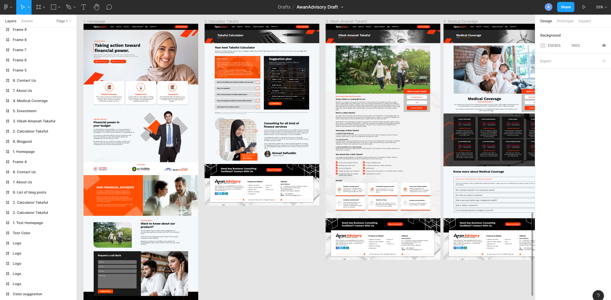
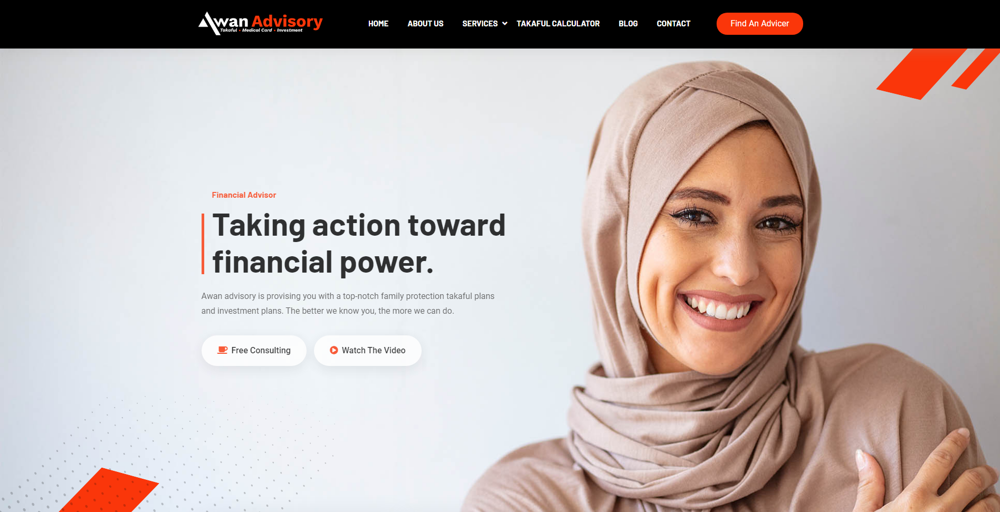

# awanadvisory
This website was created specifically for Awan Advisory, which provides insurance finance, life planning, and wealth management services. The design focuses on the professional brands and products.

I went through several phases when developing this site. Among them are;
* The requirements and design phase.
* The front end development phase.
* The back end development phase.

The site is currently 60% complete and has just begun its third phase. To view UIUX for this site, click on the following link;

Temporary link: **[Click to view the website](https://naktest.link/)** 

# 1. Requirement and design.

I conducted a URS session with the client to determine the website requirements. After deciding on colors and motifs, I began the design process. The UIUX design was created with the help of Figma.

Figma: **[UI/UX Design](https://www.figma.com/file/z8Jm25Um6Nk5gN6GxpmoFp/AwanAdvisory-Draft?node-id=0%3A1)** 
# 2. Front-end development

For front-end development, the website is built with HTML, CSS, and Javascript. 

# 3. Back-end development
Laravel will be used to develop the site's backend. Additionally, I'll leverage Botble CMS to expedite the development process.

